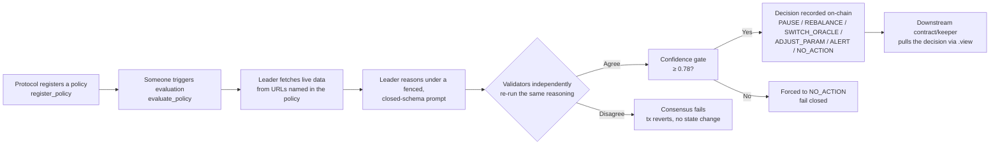

# Helm

**Intelligent Operational Control Layer for On-Chain Protocols.**

Helm lets any protocol register a natural-language operational policy once. On trigger, Helm fetches
live data from the source(s) the policy names, evaluates the policy under GenLayer's Equivalence
Principle, and records a structured, consensus-backed operational decision on-chain — one a
downstream contract, keeper, or human operator can act on.

No claims. No dispute resolution. No consistency-of-statements surface. Pure operational
intelligence.

- **Network:** GenLayer Bradbury testnet (chain id `4221`)
- **Contract address:** [`0x911B39fF368d872E1E98F084F2794C2018432C39`](https://explorer-bradbury.genlayer.com/address/0x911B39fF368d872E1E98F084F2794C2018432C39)
- **Explorer:** https://explorer-bradbury.genlayer.com

## The trust problem

Every on-chain protocol eventually needs to react to something happening in the world: a collateral
ratio drifting, an oracle going stale, a market condition shifting. Today that reaction is either:

1. **Fully manual** — a human has to notice, judge, and act, which is slow and inconsistent under
   pressure, or
2. **A rigid, pre-coded threshold** — cheap to build, but brittle: it can't weigh context, can't
   read a paragraph of nuance a legal/ops team wrote, and has to be redeployed every time the
   condition changes.

Neither gives a protocol a way to say, in its own words, *"if X is really happening, do Y"* and have
that judgment executed reliably, on-chain, without trusting a single centralized keeper's opinion of
what "X" means.

## The solution

Helm is a GenLayer Intelligent Contract that turns a plain-language operational policy into a
consensus-backed on-chain decision:



No single model's opinion ever reaches chain state unchecked — a decision only lands once
independent validators agree it's the same decision, under the same evidence, within a tight
confidence tolerance.

## Why this needs GenLayer

A deterministic smart contract cannot read "if the collateral ratio drops meaningfully below a safe
level, pause the vault" and decide what "meaningfully" and "safe" mean in context — that requires
judgment, which requires an LLM, which is non-deterministic. Running that judgment through a single
off-chain oracle just relocates the trust problem to whoever runs that oracle. GenLayer's Equivalence
Principle is what makes a judgment call cryptoeconomically trustworthy: an operational decision only
becomes canonical state once a majority of independent validators, each doing their own reasoning
against the same evidence, reach the same conclusion.

## How to use it

**1. Register a policy** (any address may call this):

```
register_policy(name, policy_text, action_mapping) -> policy_id
```

Write the trigger condition in plain language, and include the exact data source URL(s) Helm should
check directly in `policy_text` or `action_mapping` — see
[`POLICY_LANGUAGE.md`](./POLICY_LANGUAGE.md) for guidance and examples.

**2. Trigger an evaluation** (any address may call this — a keeper, a cron job, an operator, or the
policy owner):

```
evaluate_policy(policy_id) -> evaluation_id
```

**3. Read the result** (no gas, anyone):

```
get_latest_evaluation(policy_id) -> {decision, confidence, reasoning, cited_data, recommended_action_payload, ...}
get_evaluation(evaluation_id) -> same shape, for a specific past evaluation
```

**4. Act on it.** Helm never calls other contracts directly (see
[Architecture](#architecture-pull-based-actions) below) — a downstream contract or keeper reads the
decision via `.view()` and acts in its own transaction.

## Contract interface

| Method | Type | Description |
|---|---|---|
| `register_policy(name, policy_text, action_mapping)` | write | Registers a new policy, returns its `policy_id`. |
| `update_policy(policy_id, new_text, new_mapping)` | write | Owner-only. Updates an active policy's text/mapping. |
| `deactivate_policy(policy_id)` | write | Owner-only. Deactivates a policy; blocks future evaluation. |
| `evaluate_policy(policy_id)` | write | Core Intelligent Contract method. Fetches live data, evaluates under consensus, records the decision. Returns `evaluation_id`. |
| `get_policy(policy_id)` | view | Full policy record. |
| `get_evaluation(evaluation_id)` | view | A specific evaluation record. |
| `get_policies_by_owner(owner)` | view | All policies registered by an address. |
| `get_latest_evaluation(policy_id)` | view | The most recent evaluation for a policy. |
| `get_contract_info()` | view | Contract metadata: version, decision enum, confidence threshold, all policy ids. |

## Decision schema

Every evaluation produces exactly this shape (see [`POLICY_LANGUAGE.md`](./POLICY_LANGUAGE.md) for
how the underlying prompt is constructed):

```json
{
  "evaluation_id": "string",
  "policy_id": "string",
  "decision": "PAUSE | REBALANCE | SWITCH_ORACLE | ADJUST_PARAM | ALERT | NO_ACTION",
  "confidence": "string, e.g. \"0.82\" -- always a string, never a bare number",
  "reasoning": "string, <= 400 characters",
  "cited_data": ["short excerpt or url actually used", "..."],
  "recommended_action_payload": { "flat string-to-string parameters, or {}" },
  "data_sources_used": ["https://..."],
  "evaluated_at": "unix timestamp, as a string"
}
```

`confidence < 0.78`, a schema violation, a parsing failure, or no data source at all all force
`decision` to `NO_ACTION` — see [`SECURITY.md`](./SECURITY.md) for the full fail-closed design.

## Architecture: pull-based actions

Cross-contract **writes** are confirmed to silently no-op on the current Bradbury GenVM build — a
calling contract's transaction reaches `ACCEPTED` cleanly, but the target contract's state never
actually changes. Cross-contract **reads** via `.view()` are confirmed reliable. Helm's architecture
is built around this, deliberately:

- Helm stores its own decision on-chain (`get_latest_evaluation` / `get_evaluation`).
- A downstream contract or keeper pulls that decision via `.view()` whenever it wants to act on it,
  in its own transaction.

This is a tested engineering decision, not a limitation left unaddressed — see
[`SECURITY.md`](./SECURITY.md).

## Continued-use path

Helm is infrastructure, not a demo: once deployed, any number of unrelated protocols can register
policies against the same contract indefinitely, with no per-protocol redeployment. A protocol
integrates once (embed a `.view()` call to `get_latest_evaluation` in whatever keeper or contract
already watches its own state) and gets a standing, consensus-backed operational-intelligence layer
it can register new policies against at any time, for any future operational condition it wants to
automate.

## Project layout

```
helm/
├── contracts/Helm.py          # the Intelligent Contract
├── tests/direct/               # gltest direct-mode unit tests (24 passing)
├── tests/integration/          # live-network integration test skeleton
├── deploy/001_deploy_helm.ts   # genlayer-js deploy script
├── frontend/                   # Next.js 15 app (Obsidian Command design)
└── docs/                       # this file, SECURITY.md, SUBMISSION.md, POLICY_LANGUAGE.md
```

## Local development

**Contract:**

```bash
pip install -r requirements.txt
genvm-lint check contracts/Helm.py
gltest tests/direct
```

**Frontend:**

```bash
cd frontend
npm install
npm run dev
```

**Deploy** (see `CLAUDE.md` — never run without deliberately confirming wallet/network first):

```bash
HELM_DEPLOYER_PRIVATE_KEY=0x... npx tsx deploy/001_deploy_helm.ts bradbury
```

## License

MIT — see [`LICENSE`](../LICENSE).
